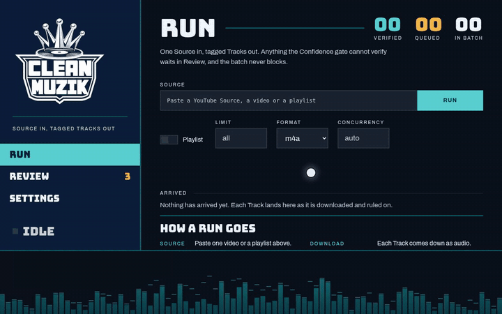

# CleanMusic

CleanMusic (the app calls itself Clean Muzik; the Python package and command are `muzik`) downloads audio from a YouTube Source and writes clean, verified music Tags into each Track. One Source in, tagged Tracks out. Anything the Confidence gate cannot verify waits in the Review queue with provisional Tags, and the batch never blocks.



The clip above is the web UI in demo mode, so the Tracks and the queue are the repo's own fixtures rather than a live download. `docs/media/record-demo.py` recorded it.

## What it does

A Source is a YouTube URL, one video or a playlist. Each Track that comes down goes through the same path:

1. yt-dlp pulls the audio and ffmpeg extracts it, as m4a by default so native AAC is copied rather than re-encoded.
2. Shazam fingerprints the Track and returns a Match, a candidate identity. With `fpcalc` and an AcoustID key present, AcoustID adds a second identity witness.
3. The Confidence gate weighs that Match against the Source's own title. A title that independently names the artist corroborates the Match, and it verifies there.
4. Where the title carries no independent artist witness, the gate consults the Resolver (Claude Haiku) as an identity witness. It reads the fingerprint result, yt-dlp's extracted metadata and the thumbnail together, and rules the Match consistent, inconsistent or unsure. Anything short of consistent stays unverified.
5. Once a Track is identified, the Authority waterfall fills in canonical Tags and cover art: Shazam's own metadata first, then MusicBrainz, then the Resolver, because none of the three is reliable alone.
6. Artist names are normalised just before writing, conservatively. Feature credits are unified and repeated credits dropped, but case is never folded and diacritics are never stripped, since those can merge two real artists.

A Track that fails the gate, or never got a Match, is written with provisional Tags and routed to the Review queue. A failure or timeout at any step does the same for that one Track, and the rest of the batch keeps going.

Clearing the queue is one pass after the batch: listen to the Track, compare what the fingerprint heard with what the Source claims, read the identity witness's rationale, then accept the provisional Tags, type them yourself, feed the Resolver a hint, or skip.

## CLI and web

The engine knows nothing about either interface. The CLI and the web adapter are siblings over it (ADR-0001, ADR-0010), so a run behaves the same whichever one starts it.

## Requirements

- Python 3.10 or 3.11. Not 3.14, where `shazamio-core` has no wheel and its Rust build fails.
- `ffmpeg` on `PATH`, for audio extraction and for down-converting clips to fingerprint.
- A JavaScript runtime on `PATH`, [deno](https://deno.land) being yt-dlp's recommended one. yt-dlp needs it for YouTube extraction. Without it, yt-dlp falls back to a deprecated path that pulls degraded audio, which weakens the fingerprint and sends Tracks to Review that should have verified.
- `fpcalc` (Chromaprint) on `PATH` for the AcoustID witness: `apt install libchromaprint-tools` or `brew install chromaprint`. Without it, AcoustID disables itself and identity checks use Shazam alone.
- [`uv`](https://docs.astral.sh/uv/) for the environment.

## Setup

```bash
uv venv --python 3.11
uv pip install -e ".[dev,web]"
```

Two keys go in `.env`, both optional:

- `ANTHROPIC_API_KEY` for the Resolver. Without it the pipeline still runs and the identity witness degrades to unsure, which keeps Tracks unverified instead of guessing.
- `ACOUSTID_API_KEY` for the second fingerprint witness. Free from [acoustid.org](https://acoustid.org/new-application).

## Running it

One video:

```bash
.venv/bin/muzik "https://www.youtube.com/watch?v=<id>" --out downloads
```

A playlist has to be asked for, because a link with a list attached usually means the one video (ADR-0004):

```bash
.venv/bin/muzik "https://www.youtube.com/playlist?list=<id>" --playlist --out downloads
```

Useful flags: `--format {m4a,mp3-320}`, `--limit N` to take only a playlist's first N entries, `--concurrency N`, `--cookies <file>` for age-restricted Sources, and `--review` to work the queue instead of downloading. `muzik --help` has the rest.

The web UI is the same engine behind three views, Run, Review and Settings:

```bash
.venv/bin/python -m muzik.web            # http://127.0.0.1:8765
```

It binds localhost only. Widening that, to a tailnet address for checking a batch from a phone, is a deliberate `--host` call.

To see the interface with no keys, no network and nothing written to your library:

```bash
.venv/bin/python -m muzik.web --demo
```

Demo state lives in a fresh temp directory, settings included, so it cannot touch the real one.

## What lands on disk

Tagged Tracks go to `--out`. Beside them sit two files Muzik owns. `.muzik-manifest.txt` holds one video id per line, so a re-run never re-downloads a Track it already produced (ADR-0009). A `--playlist` run also writes an `.m3u8` holding that playlist's grouping, as relative paths a library can import. The grouping stays out of the Tags, where the album field is the Track's real album (ADR-0005).

## Testing

| Layer | What it does | How to run |
|---|---|---|
| Offline suite | Every external service (yt-dlp, Shazam, AcoustID, MusicBrainz, the Resolver) is replaced by a fake at a clean seam. The tag-writing tests use real files: 1-second clips generated with ffmpeg. CI runs the suite on every push and pull request. | `.venv/bin/pytest` |
| Live contract tests | Opt-in tests against the real services. A case skips when a key, the network or a tool is missing, so an absent dependency never shows up as a failure. | `.venv/bin/pytest -m smoke` |
| Benchmarking harness | [`tools/observe.py`](tools/observe.py) runs a real batch and records, for each Track, what the pipeline computes but doesn't print: the fingerprint result, the gate path it took, the source that placed the album, and the identity witness's verdict and how long it took. | `python tools/observe.py "<url>"` |
| Re-check harness | [`tools/recheck.py`](tools/recheck.py) re-runs a Review queue's Tracks (audio on disk) through today's identification and Confidence gate without writing anything, and prints one row per Track: the old reason, what Shazam and AcoustID heard, the gate path, and the identity witness's verdict and rationale. Shazam isn't fully repeatable, so compare outcomes rather than raw strings. | `python tools/recheck.py downloads/review-queue.jsonl` |

A fake behaves the way its author believes the real service behaves, so it can't catch a wrong belief. Live runs have caught defects that the offline suite passed:

- Real Shazam confidence is always `1.0`, so a 0.9 threshold could never fail on real data.
- yt-dlp filters already-archived entries during extraction, as well as at download, which broke re-run detection.

Both are written up in [`docs/LEARNINGS.md`](docs/LEARNINGS.md).

## How it is built

Development runs as an agentic workflow in Claude Code. A written spec (issue #1) is split into scoped GitHub issues. Each issue is built on its own branch and merged through a pull request along with its tests, and architecture decisions are recorded as ADRs.

## Where the rest is written down

- [`CONTEXT.md`](CONTEXT.md) is the glossary. Source, Track, Match, Confidence gate, Authority, Resolver and the rest all mean something specific here, and the file says what.
- [`PRODUCT.md`](PRODUCT.md) is what the thing is for and who uses it.
- [`DESIGN.md`](DESIGN.md) is the visual spec for anything under `src/muzik/web/static/`.
- [`docs/adr/`](docs/adr/) holds the decisions and why they went that way.
- [`docs/LEARNINGS.md`](docs/LEARNINGS.md) records what live runs actually showed.
- [`docs/DEVELOPMENT.md`](docs/DEVELOPMENT.md) covers setup and the test suites in more detail.
- [`docs/media/record-demo.py`](docs/media/record-demo.py) recorded the clip at the top, driving the real SPA with Playwright.

## Scope

This is a personal tool for one library. There are no accounts, no onboarding and no light theme, all on purpose.

It downloads audio you have the right to access, for your own library, and it doesn't host or redistribute anything.
